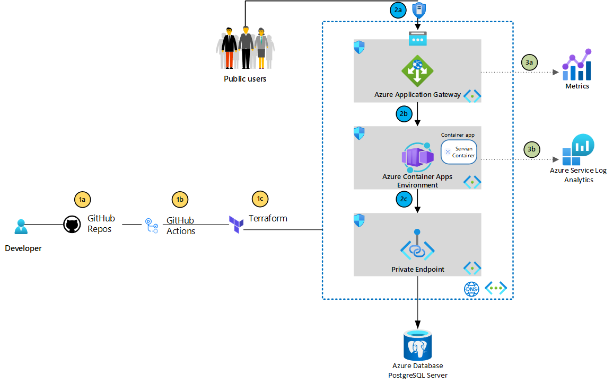

## Prerequisites


1. An Azure subscription. Sign up [for free](https://azure.microsoft.com/free/).
2. A GitHub account, with access to GitHub Actions.
3. Create an Azure Service Principal using the Azure CLI.(make sure you have access for role assignment and spn creation)

```bash
$subscriptionId=$(az account show --query id --output tsv)
az ad sp create-for-rbac --sdk-auth --name github-actions-spn --role contributor --scopes /subscriptions/$subscriptionId
```

Copy the JSON written to the screen to your clipboard.

```json
{
  "clientId": "",
  "clientSecret": "",
  "subscriptionId": "",
  "tenantId": "",
  "activeDirectoryEndpointUrl": "https://login.microsoftonline.com/",
  "resourceManagerEndpointUrl": "https://brazilus.management.azure.com",
  "activeDirectoryGraphResourceId": "https://graph.windows.net/",
  "sqlManagementEndpointUrl": "https://management.core.windows.net:8443/",
  "galleryEndpointUrl": "https://gallery.azure.com",
  "managementEndpointUrl": "https://management.core.windows.net"
}
```

4. Create the following required [encrypted secrets](https://docs.github.com/en/actions/security-guides/encrypted-secrets#creating-encrypted-secrets-for-a-repository) for the solution

| Name              | Value                                                                                                                                                                                                                                                                                                   |
| ----------------- | ------------------------------------------------------------------------------------------------------------------------------------------------------------------------------------------------------------------------------------------------------------------------------------------------------- |
| AZURE_CREDENTIALS | The JSON credentials for an Azure subscription. Make sure the Service Principal has permissions at the subscription level scope [Learn more](https://docs.microsoft.com/azure/developer/github/connect-from-azure?tabs=azure-portal%2Cwindows#create-a-service-principal-and-add-it-as-a-github-secret) |
| ARM_CLIENT_ID | client id value of your service principal|
| ARM_CLIENT_SECRET | client secret value of your service principal|
| ARM_SUBSCRIPTION_ID | subscription id value of your service principal|
| ARM_TENANT_ID| tenant id value of your service principal|
| DB_USER| username of PostgreSQL DB |
| DB_PASSWORD| password of PostgreSQL DB|


## High level Architecture




#### Part 1: DevOps for Infrastructure as Code (IaC)

1a. Developer check in code changes for infrastructure definitions of IaC templates, into GitHub repositories.

2b. GitHub Actions workflow process to test the IaC with the deployed infrastructure states and plans

3c. The IaC terraform provisions and modifies resources for each environment, tailoring size, instance count, and other properties.


#### Part 2: Typical web application traffic flow

2a. Application Gateway has web application firewall capability, which is ideal for fronting public-facing traffic before it hits the backend workload. Application Gateway exposes the public IP address, so Azure DDoS Protection provides another layer of protection.

2b. The backend pool of Application Gateway is configured with the private [DNS](https://learn.microsoft.com/en-us/azure/container-apps/networking#dns) which is associated with a private IP address of container apps env.

2c. Containers in Azure Container Environment can consume Azure Database PostgreSQL via private links.

#### Part 3: Observability

3a. Application Gateway includes a **healthy host count** metric that you can use as a liveness probe for Azure container apps, given that sample golang api should provide endpoints to support liveness or readiness probes

3b. Azure Log Analytics is used in containers apps for this solution to collect logs. For more other loggins options check this [link](https://learn.microsoft.com/en-us/azure/container-apps/log-options).


#### Networking

- [Azure DDoS Protection Standard](https://azure.microsoft.com/services/ddos-protection): Azure DDoS (Basic) Protection is free and enabled on all public IPs. Azure DDoS Protection Standard provides more capabilities, like ingesting logs to other locations and the ability to engage the DDoS Protection Rapid Response team.
- [Azure Application Gateway](https://azure.microsoft.com/en-us/services/application-gateway): Azure Web Application Firewall provides protection for public-facing applications against exploits like SQL injection and XSS attacks.
- [Azure Private Link](https://azure.microsoft.com/services/private-link): Azure Private Link provides access to Azure PaaS services via a private endpoint on the Microsoft backbone to further enhance network access security.

- [Virtual network](https://learn.microsoft.com/en-us/azure/virtual-network/virtual-network-vnet-plan-design-arm#virtual-networks) and [subnets](https://learn.microsoft.com/en-us/azure/virtual-network/virtual-network-vnet-plan-design-arm#subnets). Each tier deployed into a virtual network that segmented into a separate subnet for each tier.

- [Network security groups (NSGs)](https://learn.microsoft.com/en-us/azure/virtual-network/virtual-network-vnet-plan-design-arm#traffic-filtering). Use NSGs to restrict network traffic within the virtual network. For example, in the three-tier architecture shown here, the database tier does not accept traffic from the web front end, only from the business tier and the management subnet.(**Note:** For simplicty this is not implemented in the current IaC)

#### Application

- [Azure Container Apps](https://azure.microsoft.com/en-us/products/container-apps/): is a managed serverless container offering for building and deploying modern apps at scale. It enables developers to deploy containerized apps without managing container orchestration, Azure Container Apps uses [availability zones](https://learn.microsoft.com/en-us/azure/container-apps/disaster-recovery) in regions where they're available to provide high-availability protection for your applications and data from data center failures plus [autoscaling rule](https://learn.microsoft.com/en-us/azure/container-apps/scale-app) is applied to 30 replica. [Azure Kubernetes Service (AKS)](https://azure.microsoft.com/services/kubernetes-service) can be considered for advanced container orchestration. Other options can be found in this [link](https://learn.microsoft.com/en-us/azure/container-apps/compare-options)
- [Azure Database for PostgreSQL](https://learn.microsoft.com/en-us/azure/postgresql): is a fully managed database service designed to provide more granular control and flexibility over database management functions and configuration settings..

### Alternatives

Alternatives and other considarations including Azure Well Architecture design and CI/CD enhancements can be discussed in details later.


### Know Issues

Azure PostgreSQL using username as {user-name}@{servername} and code in file **pqdb.go** expecting owner with username without @ character, so this can be resolved by either removing owner or adding another configuration entry.